# Instalacion de librerias
#### En primer lugar, nos aseguramos de tener instaladas las librerías necesarias (pandas, numpy, matplotlib, seaborn, scikit-learn). En caso de necesitar instalar alguna, durante la ejecucion del notebook la podemos instalar ejecutando el bloque de codigo al inicio del archivo. Si no es necesario, se puede saltar y pasar al siguiente bloque.

# Carga de librerias y del dataset
#### Importamos las librerias necesarias, cargamos el dataset y mostramos las primeras lineas del dataset para verificar si la carga fue correcta. En caso de haber un problema, aparecerá un mensaje diciendo que se debe verificar la ruta y el nombre del archivo (si descarga el proyecto, sera necesario ajustar la variable "file_path".

# Exploración Inicial de los Datos
#### Ahora describimos los datos y mostramos sus características principales, para asi entender la estructura y el contenido del dataset.
    
    Dimensiones del DataFrame: 1000 filas, 14 columnas
    
    Información detallada del DataFrame:
    <class 'pandas.core.frame.DataFrame'>
    RangeIndex: 1000 entries, 0 to 999
    Data columns (total 14 columns):
     #   Column             Non-Null Count  Dtype  
    ---  ------             --------------  -----  
     0   patientid          1000 non-null   int64  
     1   age                1000 non-null   int64  
     2   gender             1000 non-null   int64  
     3   chestpain          1000 non-null   int64  
     4   restingBP          1000 non-null   int64  
     5   serumcholestrol    1000 non-null   int64  
     6   fastingbloodsugar  1000 non-null   int64  
     7   restingrelectro    1000 non-null   int64  
     8   maxheartrate       1000 non-null   int64  
     9   exerciseangia      1000 non-null   int64  
     10  oldpeak            1000 non-null   float64
     11  slope              1000 non-null   int64  
     12  noofmajorvessels   1000 non-null   int64  
     13  target             1000 non-null   int64  
    dtypes: float64(1), int64(13)
    memory usage: 109.5 KB
    
#### Podemos ver que el dataset cuenta con 1000 filas (registros de pacientes) y 14 columnas (características), que los tipos de datos de cada columna son int64 y float64 y que no hay valores nulos . 

    Descripción estadística de las columnas numéricas:
              patientid         age       gender    chestpain    restingBP  \
    count  1.000000e+03  1000.00000  1000.000000  1000.000000  1000.000000   
    mean   5.048704e+06    49.24200     0.765000     0.980000   151.747000   
    std    2.895905e+06    17.86473     0.424211     0.953157    29.965228   
    min    1.033680e+05    20.00000     0.000000     0.000000    94.000000   
    25%    2.536440e+06    34.00000     1.000000     0.000000   129.000000   
    50%    4.952508e+06    49.00000     1.000000     1.000000   147.000000   
    75%    7.681877e+06    64.25000     1.000000     2.000000   181.000000   
    max    9.990855e+06    80.00000     1.000000     3.000000   200.000000   
    
           serumcholestrol  fastingbloodsugar  restingrelectro  maxheartrate  \
    count      1000.000000        1000.000000      1000.000000   1000.000000   
    mean        311.447000           0.296000         0.748000    145.477000   
    std         132.443801           0.456719         0.770123     34.190268   
    min           0.000000           0.000000         0.000000     71.000000   
    25%         235.750000           0.000000         0.000000    119.750000   
    50%         318.000000           0.000000         1.000000    146.000000   
    75%         404.250000           1.000000         1.000000    175.000000   
    max         602.000000           1.000000         2.000000    202.000000   
    
           exerciseangia      oldpeak        slope  noofmajorvessels       target  
    count    1000.000000  1000.000000  1000.000000       1000.000000  1000.000000  
    mean        0.498000     2.707700     1.540000          1.222000     0.580000  
    std         0.500246     1.720753     1.003697          0.977585     0.493805  
    min         0.000000     0.000000     0.000000          0.000000     0.000000  
    25%         0.000000     1.300000     1.000000          0.000000     0.000000  
    50%         0.000000     2.400000     2.000000          1.000000     1.000000  
    75%         1.000000     4.100000     2.000000          2.000000     1.000000  
    max         1.000000     6.200000     3.000000          3.000000     1.000000  
    

#### Tambien podemos ver un resumen estadístico de las columnas numéricas (conteo, media, desviación estándar, mínimos, máximos, cuartiles), útil para detectar anomalías o rangos inusuales, que a simple vista no se observa ninguna. 
    
    Conteo de valores únicos por columna:
    - 'patientid': 1000 valores únicos
    - 'age': 61 valores únicos
    - 'gender': 2 valores únicos
      Valores únicos: [0, 1]
    - 'chestpain': 4 valores únicos
      Valores únicos: [0, 1, 2, 3]
    - 'restingBP': 95 valores únicos
    - 'serumcholestrol': 344 valores únicos
    - 'fastingbloodsugar': 2 valores únicos
      Valores únicos: [0, 1]
    - 'restingrelectro': 3 valores únicos
      Valores únicos: [0, 1, 2]
    - 'maxheartrate': 129 valores únicos
    - 'exerciseangia': 2 valores únicos
      Valores únicos: [0, 1]
    - 'oldpeak': 63 valores únicos
    - 'slope': 4 valores únicos
      Valores únicos: [0, 1, 2, 3]
    - 'noofmajorvessels': 4 valores únicos
      Valores únicos: [0, 1, 2, 3]
    - 'target': 2 valores únicos
      Valores únicos: [0, 1]
    

#### Como ultimo paso, se intenta identificar de manera automatica columnas categóricas y ver sus posibles valores. En este caso se puede observar que hay varias columnas categóricas y que las mismas ya se encuentran convertidas a valores numericos.

# Limpieza de datos

#### Procedemos a realizar la limpieza de los datos en caso de ser necesario, verificando valores faltantes, duplicados, outliers y, si se identifican, posibles inconsistencias en columnas categóricas.

* ## Valores faltantes
    
    Valores faltantes por columna antes de la limpieza:
    - patientid            0
    - age                  0
    - gender               0
    - chestpain            0
    - restingBP            0
    - serumcholestrol      0
    - fastingbloodsugar    0
    - restingrelectro      0
    - maxheartrate         0
    - exerciseangia        0
    - oldpeak              0
    - slope                0
    - noofmajorvessels     0
    - target               0
    
    dtype: int64
    

#### Se puede ver no hay valores faltantes. En caso de haber valores faltantes, se evaluaria si se eliminan las filas afectadas (por cantidad baja o por ser datos de poca relevancia) o se procede a completar los mismos (por cantidad alta de datos faltantes o porque los datos a eliminar son importantes), pero al no haber valore faltantes, no se realizara ninguna acciona al respecto.

* ## Filas duplicadas
    
    Número de filas duplicadas antes de la limpieza:
    0
    No se encontraron filas duplicadas.
    

#### Se puede ver que el dataset no tiene registros duplicados. En caso de haberlos tenido, se habrian eliminado automaticamente y se podria ver la cantidad en pantalla.

* ## Eliminacion de columnas innecesarias
   
    Columna 'patientid' eliminada.
    

#### Esta columna es un identificador y no debe usarse como característica para el modelo, por lo que la eliminamos.

* ## Codificacion de variables categoricas
#### Como ya pudimos observar en la exploracion inicial de datos, todas la s variables categoricas ya estan codificadas:
Conteo de valores únicos por columna:
- 'gender': 2 valores únicos [0, 1]
- 'chestpain': 4 valores únicos [0, 1, 2, 3]
- 'fastingbloodsugar': 2 valores únicos [0, 1]
- 'restingrelectro': 3 valores únicos [0, 1, 2]
- 'exerciseangia': 2 valores únicos [0, 1]
- 'slope': 4 valores únicos [0, 1, 2, 3]
- 'noofmajorvessels': 4 valores únicos [0, 1, 2, 3]
- 'target': 2 valores únicos [0, 1]
#### por lo que no es necesario codificarlas.

* ## Verificacion de que la variable "target" este balanceada

     Conteo de registros por clase en la columna 'target' después de la limpieza 
    target
    1    580
    0    420
    Name: count, dtype: int64
    
     -> La clase objetivo está balanceada.
    
    

    
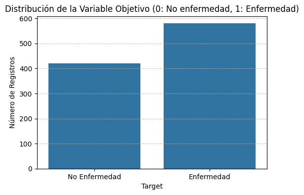
    

#### Se puede ver que la clase objetivo esta balanceada. Esto es importante ya que un desequilibrio puede sesgar el modelo, y se necesitarían técnicas especiales (como SMOTE o clase_weight en los modelos) para manejarlo.

# Guardado del dataset 
#### Guardamos el dataset en su hubicacion correspondiente. Al igual que al cvargar el archivo, verificar la ruta (si descarga el proyecto, sera necesario ajustar la variable "file_path" al inicio del archivo).

    Dataset 'cardiovascular_disease_dataset.csv' guardado exitosamente.
    
## Análisis Estadístico de los datos

### Distribución de variables numéricas (Histogramas)

    

    

#### En estos graficos podemos observar la dirtribucion de las variables numericas del dataset y el genero.
* #### Podemos ver que en el dataset predominan los datos de pacientes masculinos sobre los femeninos.
* #### La distrubucion de las edades de los pacientes es bastante pareja, con lo que podriamos decir que el dataset cuenta con una buena cantidad de ejemplos de todo el rango de edades.
* #### Podemos apreciar tambien que el colesterol en sangre tiene una distribucion del tipo normal, lo que indica que la mayoria de los pacientes del estudio presentan una media cercana a los 300mg/dL, mayor a lo aconsejable (idealmente menores a 200mg/dL).
* #### Tambien vemos que la frecuencia cardíaca máxima tiene una tendencia a los valores mas altos en las pruebas de esfuerzo, lo que generalmente es debido a factores como el ejercicio, el estrés, o incluso ciertas condiciones médicas. 
* #### La depresion del segmento ST tiende a los valores mas bajos. Esto es esperado ya que un valor de depresión superior a 2 mm se considera un indicador que requiere mayor investigación. Esto puede indicar varias condiciones, siendo la más común la isquemia miocárdica (flujo sanguíneo insuficiente al corazón), pero también puede ser causada por otros factores. 

### Box Plots para detección de Outliers

    
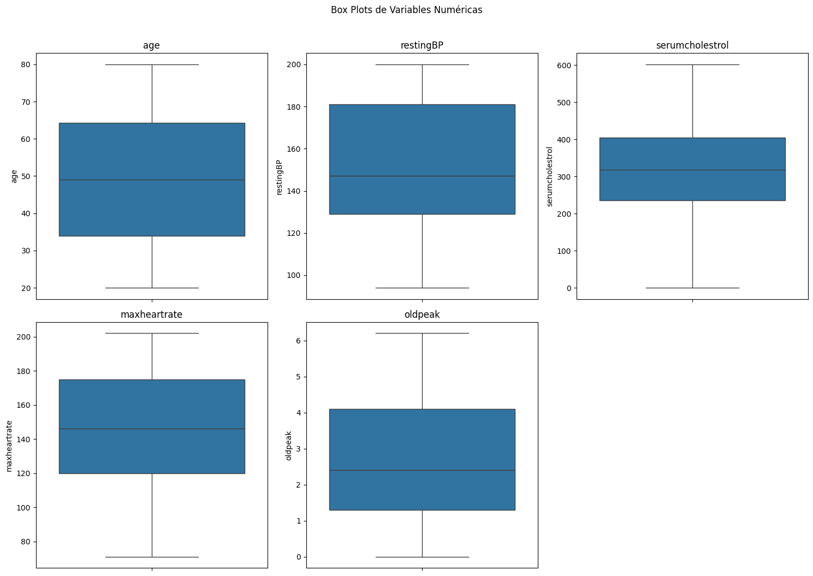
    

#### Aqui podemos ver que los datos numericos del dataset no presentan valores atipicos (outliers).

### Matriz de Correlación (Heatmap)

    
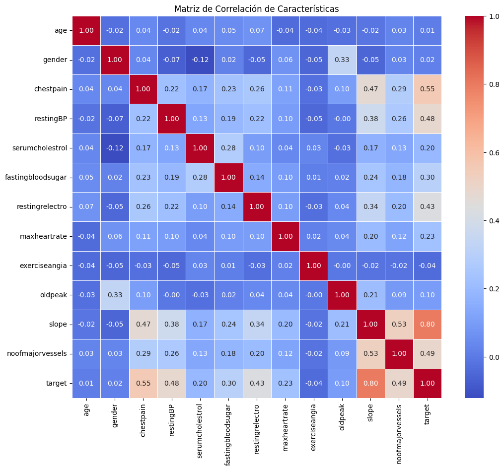
    

    
    Correlación de las características con la variable 'target':
    target               1.000000
    slope                0.797358
    chestpain            0.554228
    noofmajorvessels     0.489866
    restingBP            0.482387
    restingrelectro      0.426837
    fastingbloodsugar    0.303233
    maxheartrate         0.228343
    serumcholestrol      0.195340
    oldpeak              0.098053
    gender               0.015769
    age                  0.008356
    exerciseangia       -0.039874
    Name: target, dtype: float64
    

#### Aqui podemos observar que hay varias caracteristicas que se correlacionan entre si, principalmente target con slope (la pendiente del segmento ST en el ejercicio máximo) y con chespain (dolor en el pecho).

    
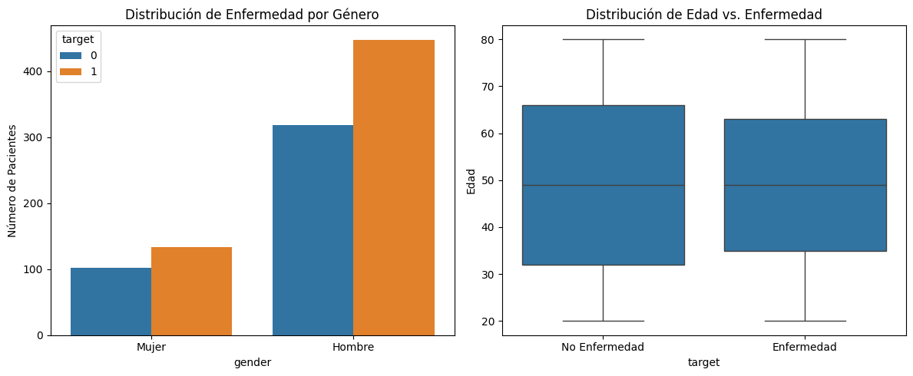
    

    <Axes: xlabel='target', ylabel='restingBP'>

    
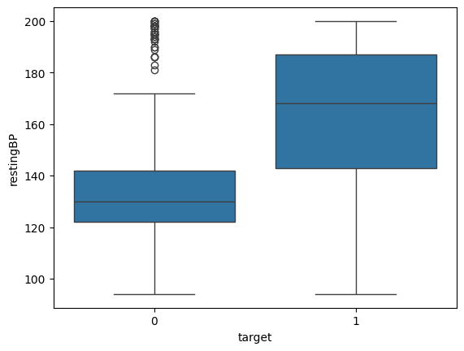
    

#### Aqui estamos explorando la relación entre algunas de las características y la variable objetivo (target). Por ejemplo, cómo la distribución de género varía entre pacientes con y sin enfermedad. Tambien vemos como los pacientes con o sin ECV tienen una distribucion normal respecto a la edad, pero respecto a la presion sanguinea (restingBP), si bien hay pacientes sanos con presion alta, los pacientes con ECV en su mayoria tienen valores de presion sanguinea altos. 

## Determinación de Modelos de Clasificación de Aprendizaje Automático
#### En base a las caracteristicas del dataset y queriendo realizar una clasificacion binaria, se decidio utilizar los siguientes modelos:
* #### Regresión Logística
* #### Árboles de Decisión
* #### K-Nearest Neighbors (KNN)
* #### Support Vector Machine (SVM)
* #### Random Forest

## Implementación de Modelos de Clasificación

### División del dataset
#### Consideraremos la división del dataset (80/20) para entrenamiento y pruebas y el escalado de los datos.

    
    Dimensiones de X_train: (800, 12)
    Dimensiones de X_test: (200, 12)
    Dimensiones de y_train: (800,)
    Dimensiones de y_test: (200,)
    

### Escalado de los datos

#### Ahora aplicamos StandardScaler a las características numéricas. Es necesario para algoritmos basados en distancia como KNN y SVM, y para la Regresión Logística, pero no es estrictamente necesario para Árboles de Decisión, Random Forest, aunque no les perjudica y es una buena práctica general.
   
    Datos escalados. Ejemplo de las primeras filas de X_train_scaled:
              age  gender  chestpain  restingBP  serumcholestrol  \
    289  0.154414       1  -1.021562  -0.126198         1.757440   
    821 -0.180208       1  -1.021562  -0.962225        -0.465192   
    66   1.660211       1   2.137908   1.612738        -0.343404   
    190  1.269819       1   1.084752   0.943916         1.810723   
    256  1.660211       1   1.084752   0.709829        -2.352908   
    
         fastingbloodsugar  restingrelectro  maxheartrate  exerciseangia  \
    289                  0         0.327621     -0.301112              1   
    821                  1        -0.976343     -1.488201              0   
    66                   1         1.631586      0.618881              0   
    190                  1        -0.976343     -0.004340              0   
    256                  0        -0.976343     -0.657239              0   
    
          oldpeak     slope  noofmajorvessels  
    289 -1.046235  0.456386          0.790183  
    821 -1.568590 -1.527901         -1.255598  
    66  -0.930156  1.448530          0.790183  
    190  1.449464  0.456386         -0.232708  
    256  1.855741  0.456386          0.790183  
    

### Implementación de los modelos

#### Para optimizar el notebook y no repetir el código, se generó un bucle para el entrenamiento de los modelos.

    Entrenando y evaluando: Regresión Logística 
    Entrenando y evaluando: Árbol de Decisión 
    Entrenando y evaluando: K-Nearest Neighbors (KNN) 
    Entrenando y evaluando: Support Vector Machine (SVM) 
    Entrenando y evaluando: Random Forest 
    

### Efectividad de cada modelo y comparacion entre ellos
#### A continuacion evaluamos el rendimiento de cada modelo utilizando distintas métricas y las comparamos para determinar cuál es el más efectivo.

    
     Métricas para Regresión Logística 
                  precision    recall  f1-score   support
    
               0       0.99      0.96      0.98        84
               1       0.97      0.99      0.98       116
    
        accuracy                           0.98       200
       macro avg       0.98      0.98      0.98       200
    weighted avg       0.98      0.98      0.98       200
    
    Matriz de Confusión:
    [[ 81   3]
     [  1 115]]
    

    
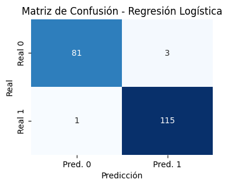
    

    
     Métricas para Árbol de Decisión 
                  precision    recall  f1-score   support
    
               0       0.96      0.98      0.97        84
               1       0.98      0.97      0.98       116
    
        accuracy                           0.97       200
       macro avg       0.97      0.98      0.97       200
    weighted avg       0.98      0.97      0.98       200
    
    Matriz de Confusión:
    [[ 82   2]
     [  3 113]]
    

    

    

    
     Métricas para K-Nearest Neighbors (KNN) 
                  precision    recall  f1-score   support
    
               0       0.93      0.93      0.93        84
               1       0.95      0.95      0.95       116
    
        accuracy                           0.94       200
       macro avg       0.94      0.94      0.94       200
    weighted avg       0.94      0.94      0.94       200
    
    Matriz de Confusión:
    [[ 78   6]
     [  6 110]]
    

    
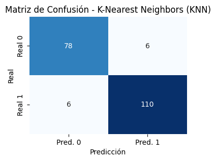
    

    
     Métricas para Support Vector Machine (SVM) 
                  precision    recall  f1-score   support
    
               0       0.96      0.95      0.96        84
               1       0.97      0.97      0.97       116
    
        accuracy                           0.96       200
       macro avg       0.96      0.96      0.96       200
    weighted avg       0.96      0.96      0.96       200
    
    Matriz de Confusión:
    [[ 80   4]
     [  3 113]]
    

    
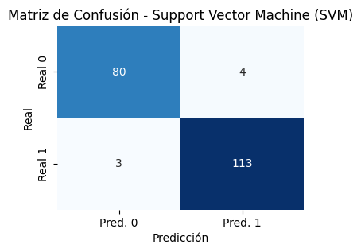
    

    
     Métricas para Random Forest 
                  precision    recall  f1-score   support
    
               0       0.99      0.98      0.98        84
               1       0.98      0.99      0.99       116
    
        accuracy                           0.98       200
       macro avg       0.99      0.98      0.98       200
    weighted avg       0.99      0.98      0.98       200
    
    Matriz de Confusión:
    [[ 82   2]
     [  1 115]]
    

    
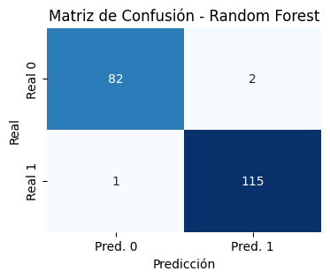
    

    
     Comparación de Métricas de Rendimiento de los Modelos 
                                  Accuracy  Precision    Recall  F1-Score  \
    Modelo                                                                  
    Random Forest                    0.985   0.982906  0.991379  0.987124   
    Regresión Logística              0.980   0.974576  0.991379  0.982906   
    Árbol de Decisión                0.975   0.982609  0.974138  0.978355   
    Support Vector Machine (SVM)     0.965   0.965812  0.974138  0.969957   
    K-Nearest Neighbors (KNN)        0.940   0.948276  0.948276  0.948276   
    
                                   ROC_AUC  
    Modelo                                  
    Random Forest                 0.999282  
    Regresión Logística           0.998255  
    Árbol de Decisión             0.975164  
    Support Vector Machine (SVM)  0.997434  
    K-Nearest Neighbors (KNN)     0.986864  
    

    
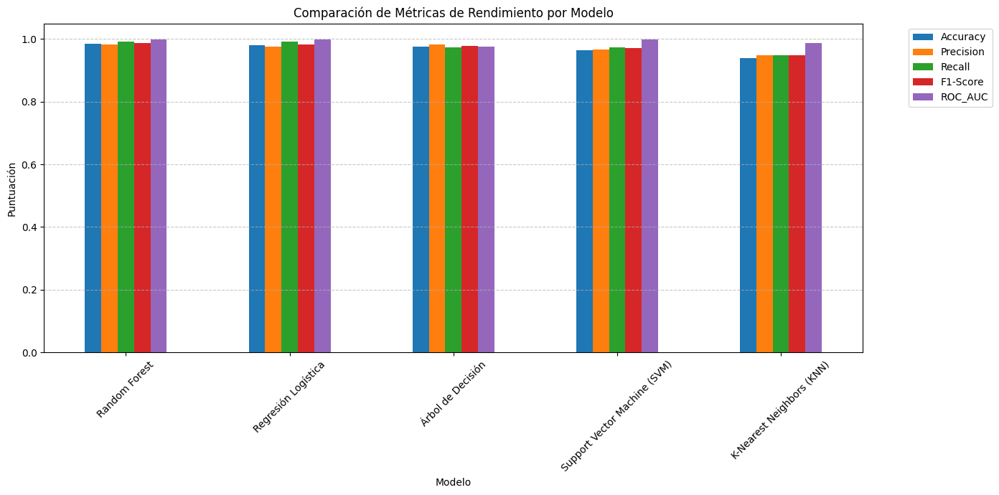
    

    Basándonos en las métricas, el modelo más efectivo es **Random Forest**.
    Su F1-Score es de 0.9871 y su ROC AUC es de 0.9993.
    

#### Basándonos en las métricas, el modelo más efectivo es **Random Forest**.
#### Su F1-Score es de 0.9871 y su ROC AUC es de 0.9993.
#### Ahora que ya sabemos cual es el modelo elegido, vamos a ver cuales son las caracteristicas que mas influyeron en él y en que porcentaje influyo cada una.

    
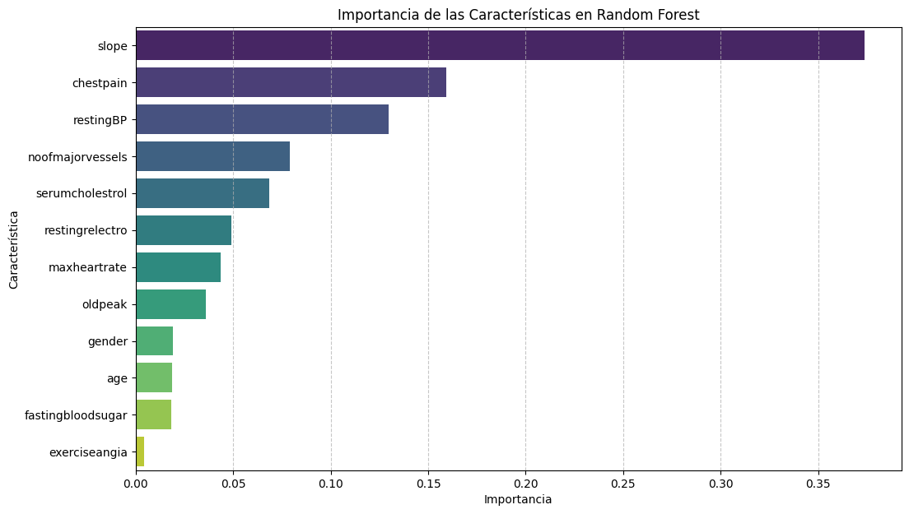
    

    
    Importancia de las características (ordenadas):
    slope                0.373979
    chestpain            0.159437
    restingBP            0.129842
    noofmajorvessels     0.079116
    serumcholestrol      0.068396
    restingrelectro      0.049270
    maxheartrate         0.043535
    oldpeak              0.036150
    gender               0.019059
    age                  0.018745
    fastingbloodsugar    0.018277
    exerciseangia        0.004193
    dtype: float64
    

### Conclusiones y Justificación del modelo más efectivo 

#### Basándonos en las métricas, el modelo más efectivo es **Random Forest**. Su F1-Score es de 0.9871 y su ROC AUC es de 0.9994.

#### La elección del "mejor" modelo es un proceso de optimización multiobjetivo. No es solo la precisión, sino el equilibrio entre rendimiento, interpretabilidad, velocidad, y recursos, alineado con los requisitos y limitaciones del problema de negocio o clínico.

#### Si bien Random Forest es marginalmente mejor en métricas clave, quizas otro modelo (como Regresión Logística o un Árbol de Decisión simple) podria ofrecer ventajas significativas en velocidad, interpretabilidad o recursos computacionales, que podrian ser críticas para su implementacion, y entonces sí, podría ser mejor elegir otro modelo. Tambien es importante considerar la **complejidad** del modelo. Un modelo de árbol de decisión podría ser preferible si la interpretabilidad es una prioridad clave, incluso si su rendimiento es ligeramente inferior a un Random Forest. 
#### Para elegir el mejor modelo, usamos F1-score y ROC-AUC. El F1-score mide el equilibrio entre precisión y exhaustividad, mientras que ROC-AUC evalúa la capacidad de discriminación del modelo en todos los umbrales. Ambos brindan una visión completa. Para problemas de salud, un buen F1-Score y un alto ROC AUC suelen ser deseables, ya que tanto diagnosticar a un sano como enfermo (falso positivo) como no diagnosticar a un enfermo (falso negativo) pueden tener consecuencias.Por ello es que en este caso, se ha utilizado el **F1-Score** (y ROC AUC como métrica complementaria) para determinar el mejor modelo. 

#### El modelo **Random Forest** mostró el mejor balance entre estas métricas, indicando una capacidad superior para clasificar correctamente ambos tipos de pacientes (con y sin enfermedad cardiovascular) en comparación con los otros modelos evaluados.

